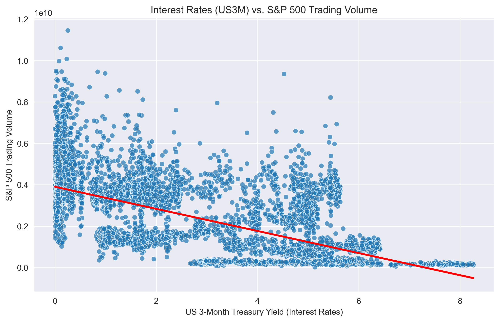

# **Predicting the S&P 500**

## **1. Introduction**

This project aims to predict future values of the S&P 500 index using machine learning models trained on historical
financial and economic data. The study involved **feature engineering**, **autoencoder-based dimensionality reduction**,
**machine learning regression models**, and **hyperparameter tuning** using Optuna.

The project follows a structured approach:

1. **Exploratory Data Analysis (EDA):** Understanding key financial indicators and their relationships.
2. **Feature Engineering:** Creating lagged and rolling-window-based features.
3. **Model Selection & Training:** Comparing regression models.
4. **Hyperparameter Optimization:** Using Bayesian Optimization (Optuna) for fine-tuning models.
5. **Evaluation:** Assessing performance using R² and MSE across multiple forecasting horizons.

---

## **2. Data Analysis and Feature Selection**

### **2.1 Dataset Overview**

The dataset consists of **historical daily stock market data**, including:

- **Market indices:** S&P 500, DJIA, HSI
- **Trading volumes:** S&P 500 volume, DJIA volume
- **Volatility index:** VIX
- **Macroeconomic indicators:** ADS index, US 3-month bond yield (US3M), joblessness rate
- **Uncertainty metrics:** Economic Policy Uncertainty (EPU), Geopolitical Risk Index (GPRD)

---

### **2.2 Exploratory Data Analysis (EDA)**

Before building predictive models, we conducted an exploratory analysis to identify **key relationships** between
financial indicators. This helped guide **feature selection**, ensuring we included the most relevant factors for
predicting **S&P 500 movements**.

#### **Correlation Analysis**

A **correlation heatmap** was used to visualize relationships between different financial indicators, highlighting which
features are strongly associated with the **S&P 500**.

    

##### **Key Findings:**

- **Strong positive correlations**:
    - **DJIA (0.99)** and **HSI (0.70)**: These indices move almost in sync with the **S&P 500**, making them valuable
      predictive features.
    - **S&P 500 volume (0.60)** and **DJIA volume (0.62)**: Trading volumes show a positive correlation, indicating that
      market activity follows similar patterns across indices.

- **Moderate correlations**:
    - **Economic Policy Uncertainty (EPU) (0.37)**: Higher uncertainty tends to accompany market fluctuations but with a
      weaker direct relationship.

- **Negative correlations**:
    - **Joblessness (-0.49)** and **US 3-month bond yield (US3M) (-0.32)**: Higher unemployment and rising interest
      rates often coincide with declining stock prices.

- **VIX (Volatility Index):** While not highly correlated numerically, VIX is generally **inversely related** to the
  S&P 500, with higher volatility often leading to market downturns.

These insights guided **feature selection**, ensuring that **correlated** and **economically significant**
indicators were included in the predictive models.

---

#### **Market Trends and Comparisons**

##### **Normalized Stock Indices Over Time**

    

- This plot compares the performance of **S&P 500 (blue), DJIA (green), and HSI (orange)** over time.
- Indices are **normalized** to allow direct comparisons of market behavior.
- **Major economic events** such as the **2008 Financial Crisis** and **2020 COVID-19 crash** are clearly visible,
  demonstrating periods of market downturn and recovery.

##### **S&P 500 Over Time**

    

- Illustrates the **long-term upward trend** of the **S&P 500**, with major crashes and recoveries highlighted.
- Serves as a reference for understanding short-term fluctuations in the broader market trend.

---

#### **Relationship Between Market Indices**

##### **S&P 500 vs DJIA**

    

- There is a **strong linear relationship** between the **S&P 500 and DJIA**, confirming that movements in one index are
  highly indicative of the other.
- This supports the inclusion of **DJIA** as a predictive feature for forecasting the S&P 500.

##### **S&P 500 vs Hang Seng Index (HSI)**

    

- The **S&P 500 and HSI** exhibit a **positive correlation**, but **HSI is more volatile**, suggesting that regional
  economic differences impact price movements.
- While related, HSI exhibits **higher variance**, meaning its predictive power may be more limited compared to DJIA.

---

#### **Trading Volume and Macroeconomic Factors**

##### **S&P 500 Trading Volume vs DJIA Trading Volume**

    

- **S&P 500 and DJIA trading volumes** move in tandem, indicating **similar investor behavior** across both markets.
- This supports the use of **trading volume trends** in our predictive models.

##### **Interest Rates (US3M) vs S&P 500 Trading Volume**

    

- A **negative correlation** between **US3M (interest rates) and S&P 500 trading volume** suggests that **higher
  interest rates** reduce market activity.
- This aligns with economic theory that rising interest rates lead to **lower investment in equities**.

##### **VIX (Volatility Index) vs S&P 500**

    

- **VIX measures market uncertainty**, and **high VIX values often align with S&P 500 declines**.
- While not directly correlated in absolute values, VIX provides a **risk indicator**, which can be used to adjust
  market forecasts under volatile conditions.

---

#### **Joblessness and Market Trends**

##### **S&P 500 Over Time with Joblessness Heatmap**

    

- This plot overlays **joblessness rates** on the **S&P 500 trend** to examine economic downturns.
- **Red areas** highlight periods of **high unemployment**, which often coincide with major market downturns, such as:
    - **2008 Financial Crisis**
    - **2020 COVID-19 pandemic**
- Joblessness serves as an **economic health indicator**, reinforcing its inclusion in feature selection.

---

#### **Conclusion**

The exploratory analysis identified **key financial indicators** with strong predictive potential. Features such as
**DJIA, HSI, trading volumes, interest rates, and joblessness** were selected for machine learning models based on their
observed correlations and economic significance. These findings guided the **feature engineering process**, ensuring the
most informative signals were extracted from historical data.

---

### **2.3 Feature Engineering**

We engineered features to better capture market trends:

- **Rolling Statistics:** Mean and standard deviation over **7, 14, 30, 90, 365-day** windows for **S&P 500, DJIA, HSI,
  VIX, and volumes** to smooth short-term noise.
- **Lagged Features:** **365-day lags** for **S&P 500, VIX, and S&P 500 volume** to incorporate historical trends.
- **Autoencoder Embeddings:** A **feedforward autoencoder** compressed lagged features into **lower-dimensional
  representations** for improved learning.

---

## **3. Machine Learning Models**

We tested **three** regression models to predict the next **1, 7, 14, 21, and 28** days of the S&P 500 index:

### **3.1 Models Used**

- **Linear Regression:** Simple, interpretable, and efficient baseline.
- **Ridge Regression:** Regularized linear model to prevent overfitting.
- **Support Vector Regression (SVR):** Captures nonlinear patterns but is sensitive to hyperparameters.

### **3.2 Training Process**

- **Train-Test Split:** 80% training, 20% testing (**strict time-based split** to prevent data leakage).
- **Feature Scaling:** MinMax scaling applied to continuous features, **joblessness** treated as an **ordinal
  categorical** feature.
- **Multi-Horizon Forecasting:** Predictions for **1, 7, 14, 21, and 28 days** into the future of S&P 500 index
  movement.

---

## **4. Hyperparameter Tuning with Optuna**

To optimize model performance, we used **Bayesian Optimization with Median Pruning** to efficiently tune
hyperparameters through Optuna.

### **4.1 Autoencoder Hyperparameter Tuning**

We optimized the following hyperparameters to minimize **MSE** on the reconstruction task:

- **Encoding Dimension:** 10–30
- **Hidden Layer Size:** 128–512
- **Dropout Rate:** 0.1–0.3
- **Learning Rate:** 0.0001–0.01
- **L1 Regularization:** 0.00001–0.01
- **Weight Decay:** 0.000001–0.001
- **Batch Size:** 256, 512, 1024
- **Epochs:** 75

The best model was selected based on the lowest loss.

### **4.2 Ridge and SVR Hyperparameter Tuning**

Hyperparameters were optimized to maximize **R² Score**, focusing on **first-day-ahead prediction (`sp500_next_1`)**:

- **Ridge Regression:** Tuned **alpha** (regularization strength) between **0.01 and 10**.
- **SVR:** Tuned **C (0.1 to 10), epsilon (0.01 to 1), and kernel type (rbf, linear, poly)**.

Improvements in **short-term accuracy** were expected to generalize to longer prediction horizons.

---

## **5. Results and Evaluation**

We evaluated models based on **Mean Squared Error (MSE)** and **R² Score** for each forecasting horizon.

### **5.1 Model Performance Table**

| Model                 | Day 1                    | Day 7                    | Day 14                   | Day 21                   | Day 28                   |
|-----------------------|--------------------------|--------------------------|--------------------------|--------------------------|--------------------------|
| **Linear Regression** | MSE: 7.59e-6, R²: 0.9997 | MSE: 0.00026, R²: 0.9902 | MSE: 0.00068, R²: 0.9744 | MSE: 0.00095, R²: 0.9639 | MSE: 0.00115, R²: 0.9563 |
| **Ridge Regression**  | MSE: 1.21e-5, R²: 0.9995 | MSE: 0.00025, R²: 0.9907 | MSE: 0.00063, R²: 0.9762 | MSE: 0.00092, R²: 0.9652 | MSE: 0.00107, R²: 0.9593 |
| **SVR**               | MSE: 0.00068, R²: 0.9744 | MSE: 0.00062, R²: 0.9768 | MSE: 0.00110, R²: 0.9585 | MSE: 0.00099, R²: 0.9624 | MSE: 0.00138, R²: 0.9476 |

### **5.2 Visualizing Predictions**

Below are the prediction plots for each model over different time horizons.

<table>
<tr>
    <td style="text-align: center;">
        
    </td>
    <td style="text-align: center;">
        
    </td>
</tr>
<tr>
    <td style="text-align: center;">
        
    </td>
    <td style="text-align: center;">
        
    </td>
</tr>
<tr>
    <td style="text-align: center;">
        
    </td>
    <td style="text-align: center;">
        
    </td>
</tr>
</table>

---

## **6. Conclusion**

### **6.1 Key Takeaways**

- **Feature Engineering**: Rolling averages and lagged features effectively captured market trends.
- **Model Performance**: Ridge Regression was the best-performing model across all prediction horizons, followed by
  Linear Regression. SVR struggled even with short-term predictions, but deteriorating fast for longer-term predictions.
- **Prediction Accuracy**: Short-term forecasts (**1-7 days**) were highly accurate (**R² > 0.99**), but performance
  declined over longer horizons.

### **6.2 Future Improvements**

- **Deep Learning**: Explore LSTMs or Transformers for better sequential modeling.
- **Additional Data**: Incorporate macroeconomic indicators like bond yields and credit spreads.
- **Longer Forecasts**: Extend predictions beyond **28 days** to assess model robustness.

---

### **Final Thoughts**

Ridge Regression proved highly effective for **short-term S&P 500 forecasts**, but **long-term predictions remain a
challenge**, requiring further feature engineering and potential deep learning approaches.