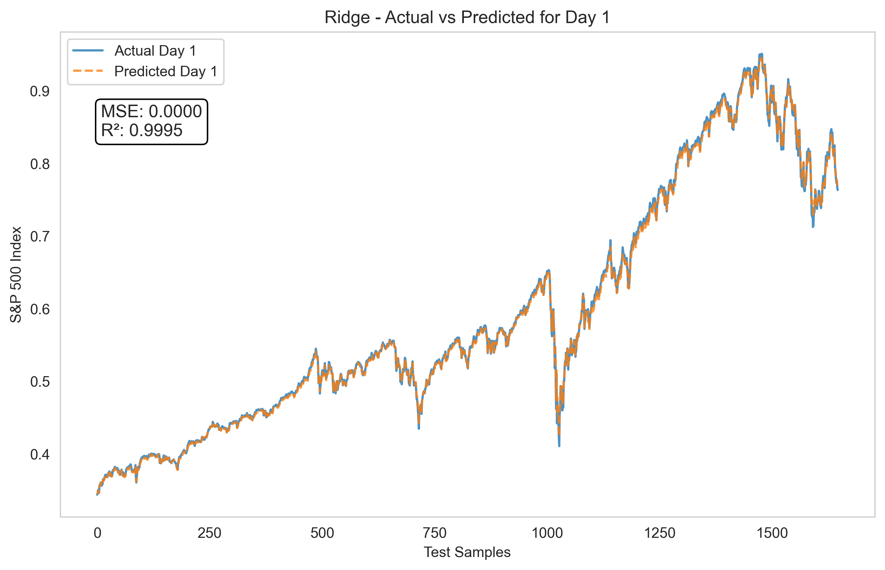

# **Predicting the S&P 500**

## **1. Introduction**

This project aims to predict future values of the S&P 500 index using machine learning models based on historical
financial and economic data. We developed a feature engineering pipeline, tested multiple regression models, and
optimized hyperparameters to improve forecasting accuracy.

## **2. Data Description**

### **2.1 Dataset Overview**

The dataset contains historical daily stock market data, including:

- **Market indices:** S&P 500, DJIA, HSI
- **Trading volumes:** S&P 500 volume, DJIA volume
- **Volatility index:** VIX
- **Macroeconomic indicators:** ADS index, US 3-month bond yield, unemployment rate
- **Uncertainty metrics:** Economic Policy Uncertainty (EPU), Geopolitical Risk Index (GPRD)

### **2.2 Feature Engineering**

We constructed various engineered features to enhance model performance:

#### **Rolling Statistics**

Computed rolling **means** and **standard deviations** for different time windows to capture market trends over
different periods.

- Windows used: **7, 14, 30, 90, 365 days**
- Applied to:
    - S&P 500 index and volume
    - DJIA index and volume
    - HSI index
    - VIX

#### **Lagged Features**

Introduced **365-day lag features** for:

- S&P 500 index
- VIX
- S&P 500 volume

This helps capture long-term dependencies and past market behavior.

#### **Autoencoder Embeddings**

Used an **autoencoder** to compress the high-dimensional lagged features into a **10-dimensional embedding**. The
autoencoder was trained using reconstruction loss with L1 regularization to avoid large encodings.

---

## **3. Machine Learning Models**

We tested **three** regression models to predict the next **1, 7, 14, 21, and 28** days of the S&P 500 index:

### **3.1 Models Used**

| Model                               | Description                                                     |
|-------------------------------------|-----------------------------------------------------------------|
| **Linear Regression**               | Baseline model, used as a benchmark                             |
| **Ridge Regression**                | Regularized linear regression to prevent overfitting            |
| **Support Vector Regression (SVR)** | Captures complex relationships but is computationally expensive |

### **3.2 Training Process**

- **Train-Test Split:** 80% for training, 20% for testing (time-based split to prevent future data leakage).
- **Feature Normalization:** Applied MinMax scaling to ensure consistent numerical ranges across features.
- **Multi-Horizon Forecasting:** Models predict **1, 7, 14, 21, 28 days ahead**.

---

## **4. Hyperparameter Tuning**

To improve model performance, we used **Optuna** for hyperparameter optimization.

### **4.1 Autoencoder Hyperparameter Tuning**

We optimized the following parameters using Bayesian Optimization:

- **Encoding Dimension:** 10 to 30
- **Hidden Layer Size:** 128 to 512
- **Dropout Rate:** 0.1 to 0.3
- **Learning Rate:** 0.0001 to 0.01
- **L1 Regularization:** 0.00001 to 0.01
- **Weight Decay:** 0.000001 to 0.001
- **Batch Size:** 256 or 512

### **4.2 Regression Model Tuning**

Hyperparameters optimized for Ridge and SVR models:

| Model                | Hyperparameters Optimized                                   |
|----------------------|-------------------------------------------------------------|
| **Ridge Regression** | Alpha (Regularization Strength)                             |
| **SVR**              | Kernel type, C (Regularization), Epsilon (Tolerance), Gamma |

---

## **5. Results and Evaluation**

We evaluated models based on **Mean Squared Error (MSE)** and **R² Score** for each prediction horizon.

### **5.1 Model Performance Table**

| Model                 | Day 1                    | Day 7                    | Day 14                   | Day 21                   | Day 28                   |
|-----------------------|--------------------------|--------------------------|--------------------------|--------------------------|--------------------------|
| **Linear Regression** | MSE: 7.59e-6, R²: 0.9997 | MSE: 0.00026, R²: 0.9902 | MSE: 0.00068, R²: 0.9743 | MSE: 0.00095, R²: 0.9639 | MSE: 0.00114, R²: 0.9563 |
| **Ridge Regression**  | MSE: 1.21e-5, R²: 0.9995 | MSE: 0.00024, R²: 0.9906 | MSE: 0.00063, R²: 0.9762 | MSE: 0.00091, R²: 0.9652 | MSE: 0.00106, R²: 0.9593 |
| **SVR**               | MSE: 0.00068, R²: 0.9744 | MSE: 0.00061, R²: 0.9767 | MSE: 0.00110, R²: 0.9584 | MSE: 0.00099, R²: 0.9624 | MSE: 0.00137, R²: 0.9476 |

### **5.2 Visualizing Predictions**

Below are the prediction plots for each model over different time horizons.

#### **Linear Regression Predictions**

  
  

#### **Ridge Regression Predictions**

  
  

#### **SVR Predictions**

  
  

---

## **6. Conclusion**

### **6.1 Key Findings**

- **Feature Engineering**: Using rolling averages and lagged features helped capture market trends effectively.
- **Model Performance**: Ridge Regression had the best performance across all horizons. SVR struggled with longer-term
  predictions.
- **Prediction Accuracy**: Short-term (1-7 days) predictions were highly accurate (**R² > 0.99**), but accuracy
  decreased for longer time horizons.

### **6.2 Future Work**

To further improve predictions, we propose:

- **Exploring deep learning models (LSTM, Transformer)** to capture sequential dependencies.
- **Incorporating alternative economic indicators** like bond yields, sector indices, and sentiment analysis.
- **Extending prediction windows beyond 28 days** to evaluate long-term forecasting performance.